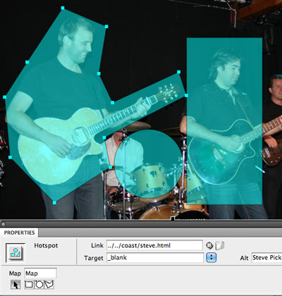

###### Front-End Develop School - sharryhong's 

# Day 03 

### 진행 내용

- 2일차 수업 내용 복습
- HTML 이미지 (Image)
- HTML 이미지맵 (ImageMap)
- HTML 목록 (Lists)
- HTML 표 (Table)
- HTML 폼 (Form)

-

### 2일차 수업 내용 복습

- 제목 [`<h1>`, `<h2>`, `<h3>`, `<h4>`, `<h5>`, `<h6>`]
- 강조 문구 [`<em>`,`<strong>`]
- 줄바꿈 `<br>`
- 윗첨자/아랫첨자 [`<sup>`, `<sub>`]
- 링크 [`<link>`, `<a href="">`]
- 보존(공백 포함) 텍스트 `<pre>`
- 수평선 `<hr>`
- 엔티티 코드
- 문법 검사
- IE 조건부 주석문 [ `<!--[if IE]> <![endif]-->`, `<!--[if !IE]><!-->  <!--<![endif]-->`]
- 파비콘
- 서버 (Node.js)
  - 절대 경로(`/`) 사용

-

### HTML 이미지

- `src`, `alt` 속성은 필히 입력해야 한다. (필수 속성)
- `width`, `height` 속성은 필히 입력해야 하는 것은 아니지만, (선택 속성)<br>좋은 UX(사용자 경험)를 위해서는 입력하는 것을 권장한다.
- alt내용 길어지면 longdesc(image long description) 속성에 설명페이지링크 등을 쓰면 된다.<br>
	: 스크린리더기에서 '설명있음'이라고 하고, 페이지에 갈 수 있게 한다.

```

<!-- 이미지에 px값 쓰지 않는다.  -->
```

-

### HTML 이미지맵 (클라이언트) : 요샌 잘 안쓴다. 

이미지맵이 포개질 경우, 먼저 정의된 영역(Area)의 URL이 우선시 된다.

 - map요소 : 맵의 전체영역 
 - area요소 : 맵 안에 다른 문서를 연결시킬 수 있는 영역 
 - img요소의 usemap속성값과 map요소의 name속성값이 같으면 연결된다.

```
<!-- 이미지에 연결할 맵을 설정할 경우, usemap 속성 사용. (<map> 요소의 name 속성 이름 앞에 #을 붙임) -->


<map name="image-map">
  <!-- [사각형, Rectangle]: 왼쪽 상단 좌표와 우측 하단 좌표를 이용하여 직사각형 영역을 지정 -->
  <area shape="rect" coords="x1,y1,x2,y2" href="링크1" alt="링크1 설명">
  <!-- [원, Circle]: 중심(Center) 좌표와 반지름(Radius)을 이용하여 원 영역을 지정 -->
  <area shape="cir" coords="center-x,center-y,radius" href="링크2" alt="링크2 설명">
  <!-- [다각형, Polygon]: (X,Y) 좌표들로 이루어진 임의의 다각형 영역을 지정 -->
  <area shape="poly" coords="x1,y1,x2,y2,x3,y3,x4,y4" href="링크3" alt="링크3 설명">
</map>
```

> ※ 이미지맵 참고 URL
> - [image-map](https://blog.goolara.com/tag/image-map/)
> - [image-maps](http://www.jednet.co.uk/edw/image_maps.html)
>
> ※ Adobe Dreamweaver 같은 도구를 사용하면 이미지맵 그리기가 수월하다.
>
> 
>
> ※ Dreamweaver 같은 도구 없이 온라인 상에서도 이미지 맵을 그릴 수 있다.<br>
> [Summer Image Map Creater](https://github.com/summerstyle/summer) <br><http://summerstyle.github.io/summer/> 에서 preview누르면 코드 나온다. 
>
> ※ jQuery imagemap 개발되어있는 plugin : 이미지맵 크기 줄어들 때 자동으로 변경되게 손쉽게 가능하다. <br>
 <http://mattstow.com/experiment/responsive-image-maps/rwd-image-maps.html> <br> <https://github.com/stowball/jQuery-rwdImageMaps>

-

### HTML 목록 : 중요~! 

HTML 표준에서 사용 가능한 목록 유형은 3가지!

- ol 요소 : 순차 목록 (Ordered List) : 순서가 중요한 목록<br>스크린리더기에서 '순차목록'이라고 읽어준다. 
- ul 요소 : 비순차 목록 (Unordered List) : 순서가 중요하지 않은 목록
- dl 요소 : 정의 목록 (Definition List) : 정의할 때만 쓰도록 하자. dt하나에 dd여러개 올 수 있다. dl안에 dt, dd만 오도록한다.
- ol과 ul 요소 자식은 li요소만 와야한다. ol, ul내부에 또다른 ol, ul이 올 수 있다. 여러 정의(dt,dd)는 dl하나로 묶는다. 

```
<!-- 일반적인 네이게이션 -->
<nav>
	<ul>
		<li>
			<a href="/">Home</a>
		</li>
		<li>
			<a href="/views/about.html">About</a>
		</li>
		<li>
			<a href="/views/project.html">Projects</a>
		</li>
		<li>
			<a href="/views/service.html">Services</a>
		</li>
		<li>
			<a href="/views/contact.html">Contact</a>
		</li>
	</ul>
</nav>
```

-

### HTML 표

표는 X, Y축으로 구성된 2차원 정보를 나타냄으로 시각 장애인이 읽기 어려운 콘텐츠로 접근성을 고려하여 제작해야 한다.<br>

- 가로 행 병합 : colspan 속성 
- 세로 열 병합 : rowspan 속성 
- `<caption>`필수로 쓰고(단, 레이아웃을 위한 표일 경우는 안쓴다.), css로 안보이게 처리하면된다. 
- `scope="col", scope="row"`속성 : 스크린리더기로 읽을 때 각 내용에 대한 제목을 읽어주므로 꼭 쓰도록 하자. 
- e-mail의 경우 아직 표로 작성해야한다. (지원안되므로)

기본 구조

```
<table>
	<caption>적절한 테이블 제목</caption>
	<thead>
		<tr>
			<th>열 제목</th>
			<th>열 제목</th>
		</tr>
	</thead>
	<tbody>
		<tr>
			<th>행 제목</th>
			<td>내용</td>
		</tr>
	</tbody>
</table>
```

예시


```
<!-- 접근성을 위해 thead, tfoot, tbody(안써도됨) 등을 쓰도록 하자. -->
<!-- thead 뒤에 tfoot가 오도록한다. 그래도 결과는 tfoot가 맨 아래에 온다. -->
<table>
	<caption>문서 메타데이터 표</caption>
	<thead>
		<!-- 행: table row -->
		<tr>
			<!-- 셀 제목 : table cell header -->
			<th scope="col">Element</th>
			<th scope="col">Description</th>
		</tr>
	</thead>
	<tfoot>
		<tr>
			<td colspan="2">Total</td>
		</tr>
	</tfoot>
	<tbody>
		<tr>
			<th scope="row">
				<code>&lt;base&gt;</code>
			</th>
			<!-- 셀 내용 : table cell data -->
			<td>
				<!-- 축약 : abbr(abbreviation). 국내에선 잘 안쓰지만 쓰면 좋겠지요~ -->
				HTML Base 요소 (<code>&lt;base&gt;</code>) 는 문서에 포함된 모든 상대 <a href="https://developer.mozilla.org/ko/docs/Web/HTML/Element" target="_blank"><abbr title="Uniform Resource Locator">URL</abbr></a>들의 기준 <abbr>URL</abbr>을 나타냅니다. 한 문서에 하나의 <code>&lt;base&gt;</code> 요소만이 올수 있습니다.
			</td>
		</tr>
	</tbody>
</table>
```

- 접근성 높이기 

```
<!-- html5에서는 summary속성을 쓰면 안된다. 없어진 이유는 기존에 summary와 caption을 동일하게 썼기 때문이다.  -->
<!-- <table summary="본 표는 3행 2열로 구성된 표이며 각 제목은 각 열에 Element, Description로 구성되어있습니다."> -->
<!-- 현재 : WAI-ARIA에 의하면 summary 대신 아래와 같이 쓴다.  -->
<p id="metadata-table-summary">본 표는 3행 2열로 구성된 표이며 각 제목은 각 열에 Element, Description로 구성되어있습니다.</p>
<table aria-describedby="metadata-table-summary">
	...
</table>
```

-

### HTML 폼

```
<form action="#" method="post" name="form_name" enctype="multipart/form-data"> 
<!-- action="데이터전송목적지.php" -->
<!-- method : 폼의 내용을 서버로 전송하는 방식. post : 보안적. get : 덜 보안적(주소 뒤에 다 붙음) -->
<!-- name : form에서는 _을 사용하도록 한다. javaScript에서는 _만 사용하기때문 -->
<!-- enctype : 위에 쓴건 파일 업로드할때만 쓰고, 아닐때는 기본처리방식이 있으므로 안써도 된다.  -->
	<p>
		<!-- label연결을 해야 스크린리더기가 제대로 읽어준다. -->
		<!-- input 요소에 암묵적 레이블 연결 : 일부 스크린리더는 안읽는다. 쓰지말자. -->
		<label>ID : <input type="text" name=""></label>	  
		<!-- input 요소에 명시적 레이블 연결 -->
		<!-- label for = input id -->
		<label for="user_id">ID : </label>
		<input type="text" name="user_id" id="user_id">
		<!-- name이 있어야 서버에 전송된다. name값이 꼭 user_id일 필요는 없다. 
		input text에 값이 sharry라고 입력되면 name.value로 sharry를 알 수 있다.-->
	</p>
	<p>
		<label for="user_pw">PASSWORD :</label> 
		<input type="password" name="user_pw" id="user_pw">
	</p>
	<p>
		<label for="user-email">E-mail :</label> 
		<input type="email" name="user-email" id="user-email">
		<!-- type="email" : @가 없으면 오류안내해줌  -->
	</p>
	<p>
		<button type="submit">전송</button> 
		<button type="reset">초기화</button>
	</p>
</form>
```

- GET

> GET requests can be cached <br>
> GET requests remain in the browser history<br>
> GET requests can be bookmarked<br>
> GET requests should never be used when dealing with sensitive data<br>
> GET requests have length restrictions<br>
> GET requests should be used only to retrieve data

- POST

> POST requests are never cached<br>
> POST requests do not remain in the browser history<br>
> POST requests cannot be bookmarked<br>
> POST requests have no restrictions on data length

-

### HTML 기타 요소 

인용구 `<q>`, 인용문 `<blockquote>`

```
<!-- 인용문(Block Quotation) -->
		<blockquote cite="http://369story.blogspot.kr/2015/01/100.html">
		<!-- cite(citation) : 출처 -->
			<p>일찍일어나는 새가 피곤하다.</p>
			<cite>박명수</cite>
			<p>삶이 있는 한 희망은 있다</p>
			<cite>키케로</cite>
		</blockquote>

		<!-- 짧은 인용문(q) -->
		<q>언제나 현재에 집중할수 있다면 행복할것이다. -파울로 코엘료 </q>
```

축약 `<abbr>`

```
<!-- 축약 : abbr(abbreviation). 국내에선 잘 안쓰지만 쓰면 좋겠지요~ -->
HTML Base 요소 (<code>&lt;base&gt;</code>) 는 문서에 포함된 모든 상대 <a href="https://developer.mozilla.org/ko/docs/Web/HTML/Element" target="_blank"><abbr title="Uniform Resource Locator">URL</abbr></a>들의 기준 <abbr>URL</abbr>을 나타냅니다. 한 문서에 하나의 <code>&lt;base&gt;</code> 요소만이 올수 있습니다.
```

`<base>` : a링크 href앞에 붙여지게 함. 많이 쓰지는 않는다.
>  `<head>` 내에 작성한다. `<base href="http://your-domain.com/" target="_blank">`

### 기타/참고

- [HTML(하이퍼텍스트 마크업 언어), MDN](https://developer.mozilla.org/ko/docs/Web/HTML)
- [HTML 소개, MDN](https://developer.mozilla.org/ko/docs/Web/HTML/Introduction)
- [올바른 주석 작성법, MDN](https://developer.mozilla.org/ko/docs/The_Importance_of_Correct_HTML_Commenting)
- [HTML 요소 레퍼런스, MDN](https://developer.mozilla.org/ko/docs/Web/HTML/Element)
- [HTML 폼 가이드, MDN](https://developer.mozilla.org/ko/docs/Web/Guide/HTML/%ED%8F%BC)
- [블록 엘리먼트, MDN](https://developer.mozilla.org/en-US/docs/Web/HTML/Block-level_elements)
- [인라인 엘리먼트, MDN](https://developer.mozilla.org/ko/docs/Web/HTML/Inline_elements)


###### ※ sublime text 관련 

 - sublime text에서 파일명 등 자동으로 뜨게 하기 :  `ctrl+shift+p(command palette) -> autofilename` 설치 
 - sublime text에서 목적하는 부분 앞뒤에 자동 요소 생기게 하기 : `ctrl+shift+g`
 - `ctrl+shift+g` 누르고 `li*` 이런식으로 하면 모든 라인에 적용된다. <br>또한 `ul>li*>a` 네비게이션에 많이쓰이는 구조가 된다.
 - sublime text에서 image size 자동으로 넣기 : `ctrl+u`
 - sublime text에서 단축키 모를 때 : `command palette`에서 `emmet update`라고 검색해보자. 
 - sublime text에서 탭키로 들여쓰기 했을시 점(스페이스바 사용)이나 -(탭 사용)보이도록 하는 것 : `preferences > setting-user`에서 `"draw_white_space": "all"` 추가 <br>나중에 sass사용시 스페이스바, 탭사용 혼용하면 오류남 

###### ※ 그 외 내용

 - 가이드만드는 문서를 만들어보는 것도 좋다. 예) sharry's의 컨벤션 
 - svg : 좌표값으로 이미지 만들어짐. <br>여러브라우저에서 깨지지 않고 보인다.<br>xml코드이다. html아님.<br>예를들어 cs6버전이면 일러스트레이터에서 벡터파일을 만들고 svg로 저장. cc버전이면 포토샵가능. 여러 파일일 경우 아트보드가 좋다.(코드가 생성됨)
 - 웹폰트와 IE : IE에선 서버환경에서만 웹폰트가 적용된다. 
 - 공부사이트 : MDN(모질라 Developer Network)에서 공부하면 좋다. <https://developer.mozilla.org/ko/> <br> 번역이 이상하게 되어있다면 일본어로 열고 마우스오른쪽>한국어로 번역하면 어느정도 번역이 잘된다. 
 - NVDA : 스크린리더 프로그램 무료 툴? 
 - form의 경우 브라우저마다 스타일 적용이 달라 작업이 힘들어 다른 요소로 만들경우 aria를 이용하여 의미연결을 하도록 한다. 
 - 페이지 링크를 facebook 등에 링크하면 자동으로 이미지, 사이트제목 등 들어가게 : meta tag에서 지정(facebook에서 지정되어있음) 