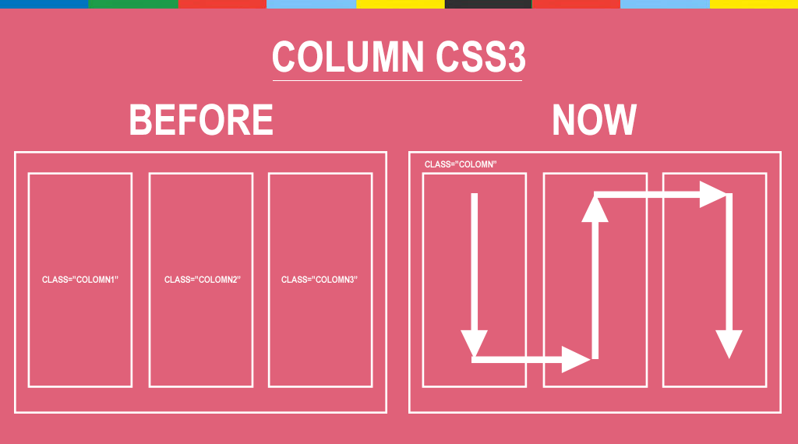
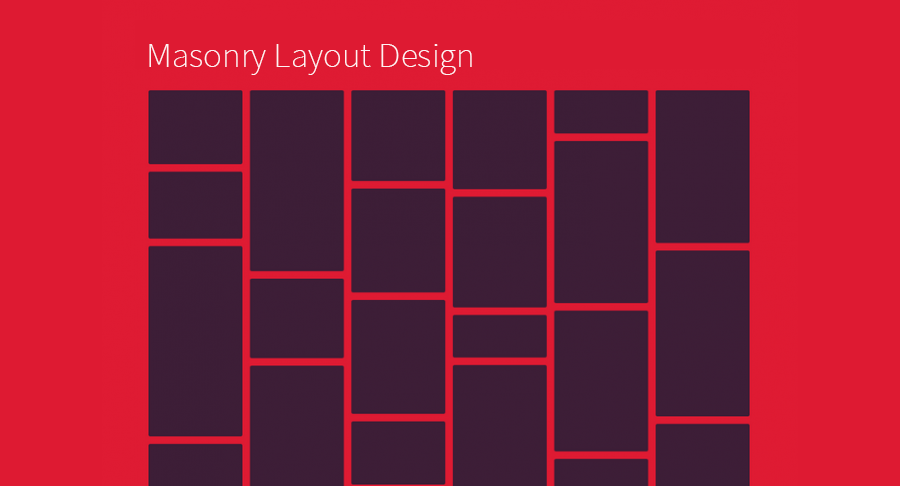

###### Front-End Develop SCHOOL

# DAY 17

### team activity 관련 - 한글 타이포그래피 인터랙티브 웹 포스터 디자인

- 구글 등에서 타이포그래피 검색해서 css 적용해보자.

- 텍스트 양쪽 정렬 [`text-align-last`](http://caniuse.com/#search=text-align-last)

> text-align: justify; 는 마지막 줄은 양쪽 정렬이 안된다. <br>
> 크로스브라우징에 주의 


```
.align-last-justify {
  width: 20rem;
  margin-left: auto;
  margin-right: auto;
  font-size: 6rem;
  text-align: justify;
  -moz-text-align-last: justify;
  text-align-last: justify;
  font-weight: 900;
}
```

-

### 1. CSS3 Animation Steps

타임라인 기반의 애니메이션을 보완해주는 `steps()` 기반의 애니메이션 방법.

- 배경이미지에 splite로 움직일 이미지 저장 
- steps(n)을 쓰지 않으면 위치까지 이동하나, steps를 쓰면 n수만큼 장면만 나와 이미지가 움직여 보이게 된다. 

```
.sprite-animation {
	width: 120px;
	height: 182px;
	border: 1px solid #999;
	background: url("../images/css-sprite-animation-steps-adam.png") no-repeat;
	animation: goBoy steps(7) 1s infinite;
}

@keyframes goBoy {
	0% { background-position-x: 0; }
	100% { background-position-x: -840px; }
}
```

-

### 2,3. Fluid Grid (모바일에 쓰면 좋다.)

> ../resources/grid-system/grid-fluid(flexable).css

- 유연한 그리드 시스템 제작 방법
- 창 크기에 따라 flexable하게 폭이 조정
- 예: .unit-1-7 { width: 1/7*100%; }
- 12개 unit까지 적용시켜 모듈화 해놓았다. 

> ../resources/grid-system/grid-fluid-1280-8.css

- unit, push, pull, prefix, suffix등을 px -> %로 하여 fluid(flexable)하게 적용 

-

### 4. CSS3 Multiple column layout

CSS3를 활용한 멀티 컬럼 디자인 방법.
- css3 Multi Columns - 쉽게 구현됨
- 크로스브라우징 신경써야함
- 잡지처럼 문맥이 흐름

> columns: width gap rule... ; (속기형)



```
/*컬럼 개수*/
-webkit-column-count: 3;
-moz-column-count: 3;
column-count: 3;

/*컬럼 사이 간격(gap)*/
-webkit-column-gap: 1.5rem;
-moz-column-gap: 1.5rem;
column-gap: 1.5rem;

/*컬럼사이 간격의 중앙에 배치되는 수직 선 */
-webkit-column-rule: 1px dashed #999;
-moz-column-rule: 1px dashed #999;
column-rule: 1px dashed #999;

.column-span h2 {
	-webkit-column-span: all;
	-moz-column-span: all;
	column-span: all;
	/*column 합치기*/
}
```

-

### 5. CSS3 Masonry Layout

높이가 불규칙한 블록을 벽돌 쌓듯이 디자인하는 레이아웃 방법.



-

### 그 외

- `background-clip: content-box;` : content box까지만 배경색 먹음
- `background-origin: content-box;` : content box에서만 배경이미지 먹음

- 이미지 lorem으로 불러오기 <http://lorempixel.com/>